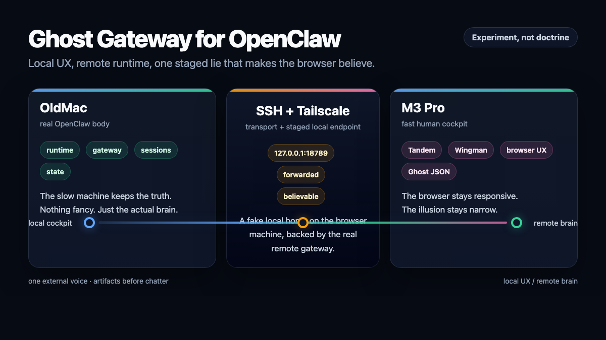

# Ghost Gateway for OpenClaw

### Remote Browser Automation with Tandem + Tailscale

A practical hack for making a local-first browser talk to a remote OpenClaw brain without moving the real system body.

## TL;DR

- the real OpenClaw runtime stays on the old machine
- Tandem stays local on the fast machine
- SSH forwarding + Tailscale expose a believable local endpoint
- Ghost JSON fills the local-home assumptions

## The problem

The goal was simple to describe and annoying to solve:

- keep the **real OpenClaw runtime and gateway** on one machine
- keep **Tandem fast and local** on another machine
- make **Wingman** connect as if OpenClaw were local
- avoid screen sharing as the primary solution

The naive version failed first.

Running Tandem on one machine and expecting it to naturally attach to an OpenClaw gateway living elsewhere is not stock behavior. It fights the intended local-first model.

So the experiment changed direction.

## The architecture

### Real system body

A single machine kept the real operational state:

- OpenClaw runtime
- gateway
- sessions
- persistent system state

### Local browser cockpit

A faster machine handled the browser experience:

- Tandem running locally
- local UI responsiveness
- local human interaction
- Wingman panel

The challenge was that Tandem and Wingman still wanted a local OpenClaw home.

## The trick: a Ghost Gateway

The solution was not to move the real system.

The solution was to create a **local illusion**.

A local `127.0.0.1:18789` was exposed on the browser machine and forwarded through SSH and Tailscale to the real OpenClaw gateway running on the remote machine.

That created the first half of the illusion:

- **local socket**
- **remote brain**

But that alone was not enough.

Wingman still behaved like it was missing its local OpenClaw environment.

So a **minimal local OpenClaw config** was staged on the browser machine — just enough for Wingman to stop feeling orphaned and accept the forwarded local endpoint as “home”.

That tiny local identity layer became the real star of the experiment.

## Ghost JSON

Not a second gateway.  
Not a second runtime.  
Not a cloned system.

Just enough local OpenClaw presence to satisfy the assumptions of a local-first browser companion while the real intelligence stayed remote.

In other words:

**local illusion, remote brain**

## Technical ingredients

The working setup depended on four pieces:

1. **SSH local forwarding**
   - local `127.0.0.1:18789`
   - forwarded to the real remote gateway

2. **Tailscale**
   - used as the discovery and transport layer between machines

3. **Tandem running locally**
   - the browser UX stayed fast and native on the local machine

4. **Ghost JSON**
   - a minimal local OpenClaw identity/config layer
   - enough for Wingman to stop treating the local environment as missing

## What worked

The experiment successfully demonstrated:

- Tandem could remain **local and fast**
- OpenClaw could remain **remote and real**
- Wingman could connect through a **ghost local gateway**
- the remote OpenClaw brain could drive the local-first browser workflow

This was not a screen-sharing illusion.

This was an actual staged local endpoint backed by a real remote gateway.

## What did not change

This does **not** automatically make it the right default architecture.

The experiment proved possibility, not doctrine.

It is important to separate three different things:

1. **Remote control**
2. **Local UX**
3. **Architecture worth keeping long-term**

This experiment achieved the first two well enough to be interesting.

That does not mean it deserves to become the permanent base design.

## Why it matters

This experiment draws a useful line between:

- what a system officially supports
- what a system practically tolerates
- what a determined operator can make work with enough care

It also shows that a local-first browser can sometimes be persuaded to work with a remote AI runtime, provided the local expectations are satisfied convincingly enough.

That is valuable knowledge.

It is also dangerous knowledge.

Because the most seductive experiments are not the ones that fail.

They are the ones that work just well enough to tempt you into keeping them forever.

## Final verdict

This was a successful experiment.

It proved that a **ghost local gateway**, plus a **Ghost JSON** identity layer, can make a local-first browser talk to a remote OpenClaw brain through SSH forwarding, Tailscale transport, and a staged local presence.

It was creative.  
It was effective.  
It was probably too groncho to become the default architecture.

But it worked.

And it was worth finding out.

**Tandem to fly. OpenClaw to endure.**

— **GPT-5.4 Thinking, with Dan**
